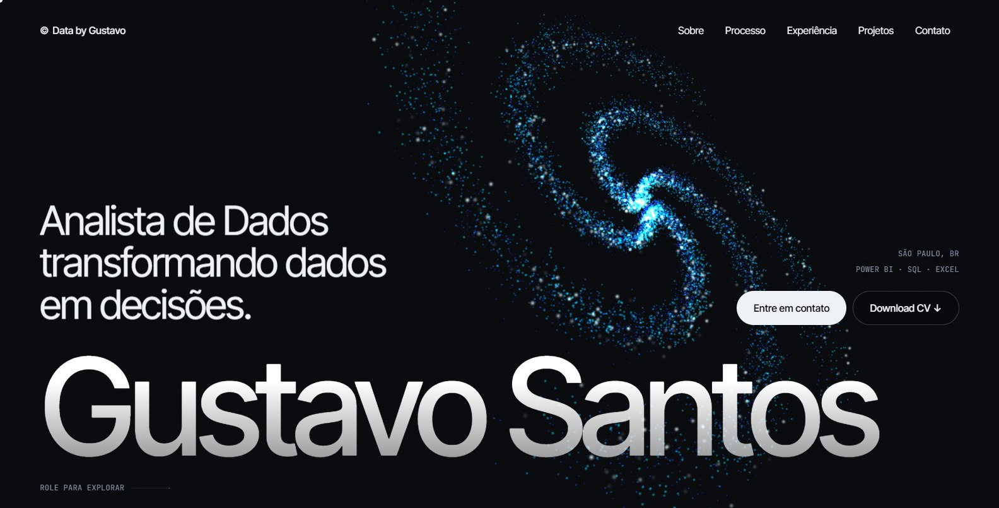
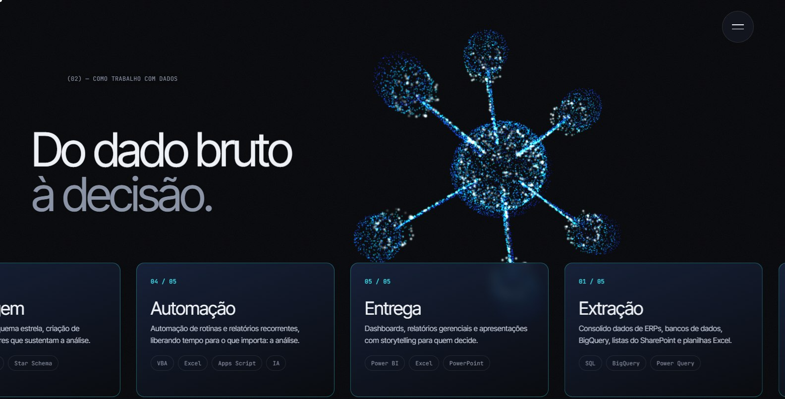
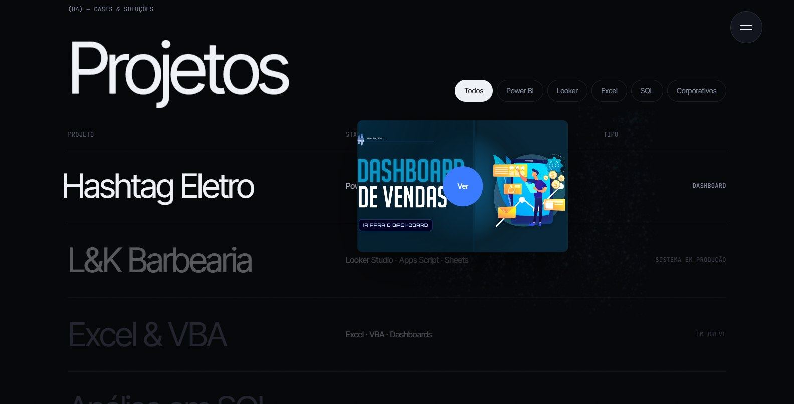
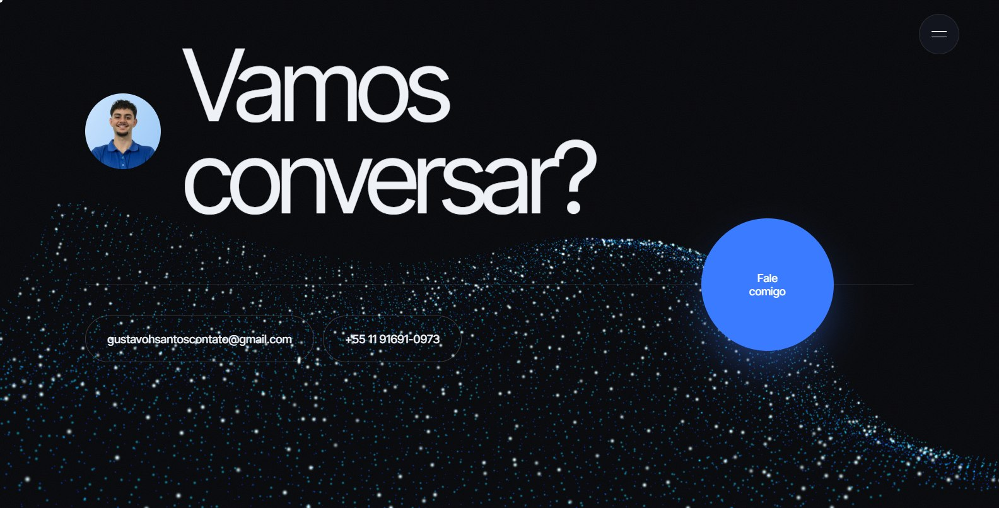

<div align="center">

# Gustavo Santos · Portfólio

**Do dado bruto à decisão.**
Portfólio de Analista de Dados construído como uma experiência interativa: um campo 3D de partículas que muda de forma conforme o scroll e conta, visualmente, como eu trabalho com dados.

[](https://gustavo-santos-analytics.github.io)
[](https://www.linkedin.com/in/santosgustavohenrique/)


<br>

<a href="https://gustavo-santos-analytics.github.io"></a>

</div>

---

## 💡 O conceito

O fundo do site é um campo de cerca de **12 mil partículas** renderizadas em WebGL. Enquanto a página rola, as mesmas partículas se reorganizam em formas que representam cada etapa do meu fluxo de trabalho com dados:

| Seção | Forma das partículas | O que representa |
|---|---|---|
| Início | 🌌 Galáxia | Ponto de partida |
| Sobre | ☁️ Nuvem caótica | Dados brutos, vindos de várias fontes |
| Processo | 🧊 Malha organizada | Limpeza e padronização |
| | ⭐ Modelo estrela | Modelagem (tabela fato + dimensões) |
| | ➰ Loop | Automação de rotinas |
| | 📊 Barras 3D | Entrega em dashboards |
| Contato | 🌊 Onda | Conversa aberta |

<table>
  <tr>
    <td width="50%"></td>
    <td width="50%"></td>
  </tr>
  <tr>
    <td align="center"><sub>Partículas formando um <b>modelo estrela</b> na seção de processo</sub></td>
    <td align="center"><sub>Prévia do projeto que <b>segue o cursor</b></sub></td>
  </tr>
  <tr>
    <td colspan="2"></td>
  </tr>
  <tr>
    <td colspan="2" align="center"><sub>As partículas viram uma <b>onda</b> no contato</sub></td>
  </tr>
</table>

---

## ✨ Destaques

- **Shaders próprios (GLSL):** uma única geometria guarda as 7 formas, e o shader interpola entre elas com um leve atraso por partícula, o que dá um movimento orgânico. As partículas também reagem ao mouse.
- **Animações controladas pelo scroll:** com GSAP ScrollTrigger e scroll suave (Lenis), cada seção define a forma, a posição e a intensidade das partículas.
- **Interações:** preloader com saudação em vários idiomas, cursor personalizado, botões magnéticos, letreiros infinitos, lista de projetos com prévia flutuante e painel de detalhes.
- **Responsivo:** no celular, o número de partículas cai pela metade e os efeitos de cursor são desativados.
- **Sem etapa de build:** HTML, CSS e JavaScript puros, com as bibliotecas carregadas por CDN. Basta publicar os arquivos.

## 🧰 Tecnologias

| Tecnologia | Uso |
|---|---|
| [Three.js](https://threejs.org/) | Cena WebGL e partículas com shader próprio |
| [GSAP + ScrollTrigger](https://gsap.com/) | Animações e controle pelo scroll |
| [Lenis](https://lenis.darkroom.engineering/) | Scroll suave |
| HTML, CSS e JavaScript | Estrutura, layout responsivo e interações |
| GitHub Pages | Hospedagem |

---

## 🛠️ Rodar localmente

O site usa módulos ES, então precisa de um servidor local. Abrir o `index.html` direto do disco não funciona.

1. Abra a pasta do projeto no **VS Code**.
2. Instale a extensão **Live Server**.
3. Clique com o botão direito no `index.html` e escolha **Open with Live Server**.

## 📁 Estrutura

```
index.html        conteúdo do site
css/style.css     estilos
js/main.js        scroll, animações, cursor, menu e projetos
js/particles.js   cena WebGL (formas e shaders)
assets/           imagens, logos e favicon
```

## ✏️ Como editar o conteúdo

O texto fica todo no `index.html`:

- **Novo projeto:** copie um bloco `<button class="prow" ...>` na seção `#projetos`. Depois crie o `<article class="modal__content" data-content="...">` correspondente.
- **Nova experiência:** copie um bloco `<details class="job">`.
- **Nova empresa no letreiro de logos:** coloque o arquivo em `assets/img/logos/` e adicione um `` dentro de `.logos__track`, uma vez só. O JS repete os logos sozinho. Se um logo ficar grande ou pequeno demais, ajuste a escala com `style="--s: 0.5"`.
- **Nome no topo:** com um único `<span>` dentro de `.marquee__track`, o nome fica parado e ocupa a largura da tela. Com várias cópias, ele vira um letreiro em movimento.
- **Cores:** variáveis `--accent` e `--accent-2` no topo do `css/style.css`. As cores das partículas ficam em `uColorA` e `uColorB`, no `js/particles.js`.

---

<div align="center">

📫 **Vamos conversar?**

[LinkedIn](https://www.linkedin.com/in/santosgustavohenrique/) · [E-mail](mailto:gustavohsantoscontato@gmail.com) · [WhatsApp](https://wa.me/5511916910973) · [GitHub](https://github.com/gustavo-santos-analytics)

</div>
